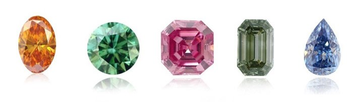

# ih_datamadpt1120_project_m2

# Data Project README file

In this project there is an analysis of a dataset that contains about 40K different type of **diamonds** (obtained form Kaggle). Each diamond has several characteristics that make each of them unique. The purpose was to obtain some insights and try to figure out which were those characteristics that afected the most on the price of each piece.

## **First Steps**

 In the notebooks folder, there is a Jupyter Notebook where there is a exploratiory analysis with a summary of statistics including descriptive statistics (max, min, mean, standard deviation, percentiles, correlations, etc.) in order to understand a litlle bit better the composition of the dataset.

Moreover, there are several data visualizations charts in order to capture a large amount of data all at once in a clear and concise manner (Box Plots, Histograms, Bar Plots, Scatter Plots, Correlation Matrix, etc.).

## **Libraries used**
1. Pandas
2. Numpy
3. Matplotlib
4. Seaborn
5. Cufflinks
6. Plotly

## **Second Part**
Once the exploratory analysis was made I built a dashboard in Tableau where it is easier and more intuitive to extract some conclusions about the dataset.

I based my analysis mainly in what is know as the 4 C's of a diamond which are crucial in order to understand the level of quality. Each C represent one of the main components of it's beauty and structure. If anybody wants to know more about the outputs checkout the dashboard, it is uploaded in Tableau Public!

